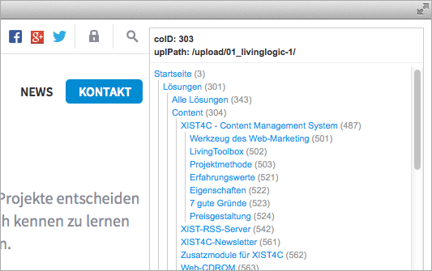

# llBookmarklet

This [bookmarklet](http://en.wikipedia.org/wiki/Bookmarklet) provides additional infos for websites generated by the [LivingLogic AG](http://www.livinglogic.de) CMS [XIST4C](http://www.xist4c.de).

The bookmarklet displays the:

* current page's content object ID (coID)
* upload path of the style files (ZIP upload)
* sitemap (all pages!)

## Installation

Drag this button to your browser's favorites bar:

<a href="javascript:(function()%7Bvar%20a%2Cg%3Ba%3D%22bookmarkletOuterShell%22%3Bg%3D%22bookmarkletNavShell%22%3Bfunction%20j(m%2Cl)%7Bvar%20k%2Cn%3Bk%3Ddocument.createElement(%22a%22)%3Bk.style.color%3D%22%231f98ec%22%3Bk.style.display%3D%22block%22%3Bk.style.paddingLeft%3D%225px%22%3Bk.style.whiteSpace%3D%22nowrap%22%3Bk.style.textTransform%3D%22none%22%3Bk.style.font%3D%22normal%20normal%2011px%2F16px%20Arial%22%3Bk.setAttribute(%22href%22%2Cm.href)%3Bif(m.type%3D%3D%3D%22here%22)%7Bk.style.fontWeight%3D%22bold%22%3Bk.style.color%3D%22%23ffba36%22%7Dk.appendChild(document.createTextNode(m.title))%3Bn%3Ddocument.createElement(%22span%22)%3Bn.style.color%3D%22%23999%22%3Bn.appendChild(document.createTextNode(%22%20(%22%2Bm.id.split(%22co_%22)%5B1%5D%2B%22)%22))%3Bk.appendChild(n)%3Bif(l)%7Bl.appendChild(k)%7D%7Dfunction%20e(k%2Cn)%7Bvar%20m%2Co%2Cl%2Cp%3Bp%3D(n%3Fn%3Adocument.getElementById(g))%3Bfor(m%3D0%3Bm%3Ck.length%3Bm%2B%2B)%7Bo%3Dk%5Bm%5D%3Bif((typeof(o)%3D%3D%3D%22object%22)%26%26(typeof(o.length)%3D%3D%3D%22number%22))%7Bl%3Ddocument.createElement(%22div%22)%3Bl.style.borderLeft%3D%221px%20solid%20%23ccc%22%3Bl.style.marginLeft%3D%2210px%22%3Bp.appendChild(l)%3Be(o%2Cl)%7Delse%7Bif((typeof(o)%3D%3D%3D%22object%22)%26%26(typeof(o.length)!%3D%3D%22number%22))%7Bj(o%2Cp)%7D%7D%7D%7Dif(typeof%20XIST4C_GLOBALS!%3D%3D%22undefined%22)%7Bvar%20f%2Cd%2Ch%2Cb%2Ci%2Cc%3Bf%3Ddocument.createElement(%22div%22)%3Bf.id%3Da%3Bf.style.font%3D%22normal%20normal%2011px%2F16px%20Arial%22%3Bf.style.background%3D%22%23fff%22%3Bf.style.position%3D%22absolute%22%3Bf.style.top%3D%2210px%22%3Bf.style.right%3D%2210px%22%3Bf.style.zIndex%3D%22100000%22%3Bf.style.border%3D%221px%20solid%20%23ccc%22%3Bdocument.body.appendChild(f)%3Bd%3Ddocument.createElement(%22div%22)%3Bd.style.padding%3D%225px%22%3Bd.style.fontWeight%3D%22bold%22%3Bd.style.borderBottom%3D%221px%20solid%20%23eee%22%3Bd.style.marginBottom%3D%225px%22%3Bh%3Ddocument.createTextNode(%22coID%3A%20%22%2B(typeof%20XIST4C_GLOBALS.meta.coID!%3D%3D%22undefined%22%3FXIST4C_GLOBALS.meta.coID%3A%22%22))%3Bb%3Ddocument.createTextNode(%22uplPath%3A%20%22%2B(typeof%20XIST4C_GLOBALS.uplPath!%3D%3D%22undefined%22%3FXIST4C_GLOBALS.uplPath%3A%22%22))%3Bi%3Ddocument.createElement(%22br%22)%3Bd.appendChild(h)%3Bd.appendChild(i)%3Bd.appendChild(b)%3Bdocument.getElementById(a).appendChild(d)%3Bif(typeof%20XIST4C_GLOBALS.sitemap!%3D%3D%22undefined%22)%7Bc%3Ddocument.createElement(%22div%22)%3Bc.id%3Dg%3Bc.style.height%3Dwindow.innerHeight-70%2B%22px%22%3Bc.style.overflow%3D%22auto%22%3Bc.style.overflowX%3D%22hidden%22%3Bc.style.paddingRight%3D%2220px%22%3Bdocument.getElementById(a).appendChild(c)%3Be(XIST4C_GLOBALS.sitemap)%7D%7D%7D)()%3B" onclick="window.alert('Right click on the button and select \'Add to Favorites\'...');return false;"></a>

or right click on the button and select 'Add to Favorites'

or step-by-step in your browser:

1. Create a new bookmark.
2. Choose any name for your bookmark.
3. Copy the whole text of the `llBookmarklet.txt` file into the bookmark's address field.

## Usage
Open your website and click on the created bookmark – Done!

## More LivingLogic tools
[LivingLogic on Github](https://github.com/LivingLogic)

## License

The MIT License (MIT)

Copyright (c) 2014 Stefanie Ambrosch

Permission is hereby granted, free of charge, to any person obtaining a copy of
this software and associated documentation files (the "Software"), to deal in
the Software without restriction, including without limitation the rights to
use, copy, modify, merge, publish, distribute, sublicense, and/or sell copies of
the Software, and to permit persons to whom the Software is furnished to do so,
subject to the following conditions:

The above copyright notice and this permission notice shall be included in all
copies or substantial portions of the Software.

THE SOFTWARE IS PROVIDED "AS IS", WITHOUT WARRANTY OF ANY KIND, EXPRESS OR
IMPLIED, INCLUDING BUT NOT LIMITED TO THE WARRANTIES OF MERCHANTABILITY, FITNESS
FOR A PARTICULAR PURPOSE AND NONINFRINGEMENT. IN NO EVENT SHALL THE AUTHORS OR
COPYRIGHT HOLDERS BE LIABLE FOR ANY CLAIM, DAMAGES OR OTHER LIABILITY, WHETHER
IN AN ACTION OF CONTRACT, TORT OR OTHERWISE, ARISING FROM, OUT OF OR IN
CONNECTION WITH THE SOFTWARE OR THE USE OR OTHER DEALINGS IN THE SOFTWARE.